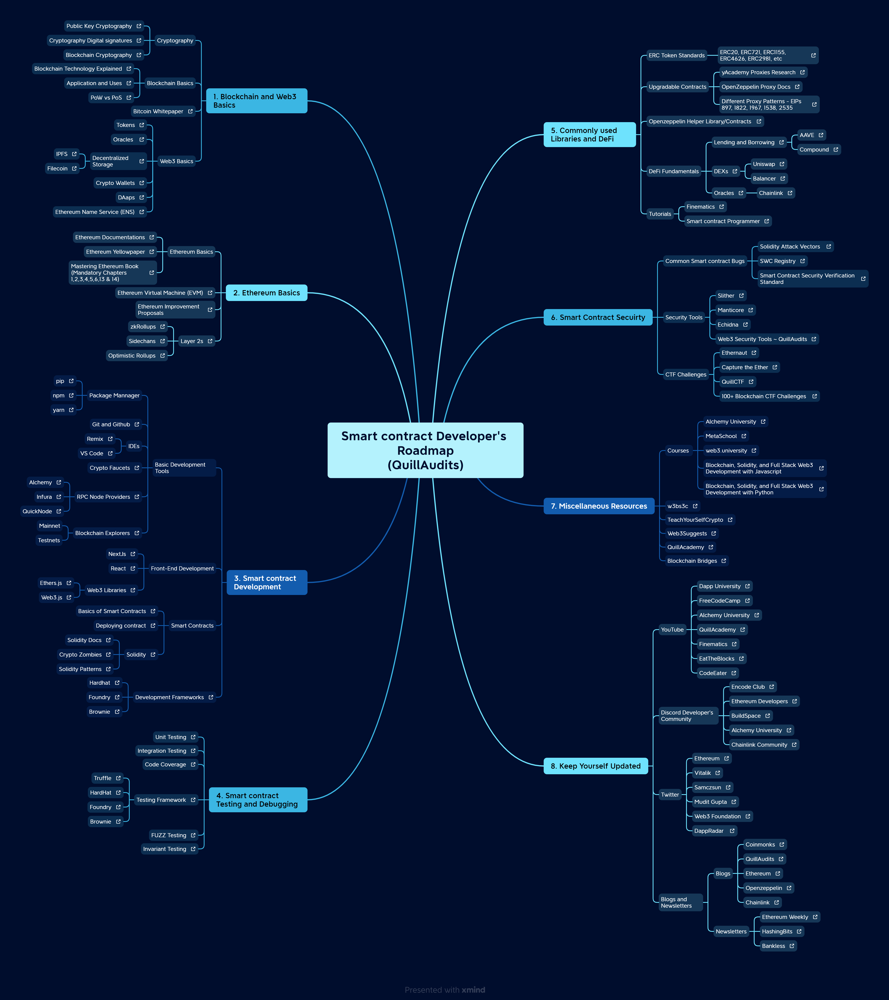

# Smart contract Developer's Mindmap

Pdf Link: [QuillAudit_Auditor_Roadmap.pdf](data/smart-contract-developers-roadmap.pdf)

Xmind Link: https://xmind.works/share/7WDFiNis

---

Here is the best roadmap for you to become a Smart Contract Developer!
If you find anything missing or want to update existing resources, you can create a pull request and contribute to the project.

---

## Steps to Follow:

### 1. Blockchain and Web3 Basics
- **Cryptography**
    - [Public Key Cryptography](https://iopscience.iop.org/article/10.1088/1742-6596/1477/5/052062/pdf)
    - [Cryptography Digital signatures](https://www.tutorialspoint.com/cryptography/cryptography_digital_signatures.htm)
    - [Blockchain Cryptography](https://101blockchains.com/blockchain-cryptography/)
- **Blockchain Basics**
    - [Blockchain Technology Explained](https://www.youtube.com/watch?v=qOVAbKKSH10)
    - [Application and Uses](https://www.geeksforgeeks.org/top-applications-of-blockchain-in-the-real-world/)
    - [PoW vs PoS](https://www.youtube.com/watch?v=SiKnWBPkQ4I&t=3s)
- [**Bitcoin Whitepaper**](https://bitcoin.org/bitcoin.pdf)
- **Web3 Basics**
    - [Tokens](https://www.yourdevopsguy.com/the-ultimate-guide-to-crypto-tokens/)
    - [Oracles](https://www.youtube.com/watch?v=m64dLRjJ9Bs)
    - [Decentralized Storage](https://www.protocol.com/ipfs-new-internet)
        - [Filecoin](https://www.youtube.com/watch?v=5Uj6uR3fp-U)
        - [IPFS](https://www.youtube.com/watch?v=NOazY8qvSts)
    - [Crypto Wallets](https://www.coinbase.com/learn/crypto-basics/what-is-a-crypto-wallet)
    - [DAaps](https://ethereum.org/en/developers/docs/dapps/)
    - [Ethereum Name Service (ENS)](https://docs.ens.domains/)

---

### 2. Ethereum Basics
- **Ethereum Basics**
    - [Ethereum Documentations](https://ethereum.org/en/developers/docs/)
    - [Ethereum Yellowpaper](https://ethereum.github.io/yellowpaper/paper.pdf)
    - [Mastering Ethereum Book (Mandatory Chapters 1,2,3,4,5,6,13 & 14)](https://github.com/ethereumbook/ethereumbook)
- [**Ethereum Virtual Machine (EVM)**](https://ethereum.org/en/developers/docs/evm/)
- [**Ethereum Improvement Proposals**](https://eips.ethereum.org/)
- [**Layer 2s**](https://www.youtube.com/watch?v=BgCgauWVTs0)
    - [zkRollups](https://ethereum.org/en/developers/docs/scaling/zk-rollups/)
    - [Sidechans](https://ethereum.org/en/developers/docs/scaling/sidechains/)
    - [Optimistic Rollups](https://ethereum.org/en/developers/docs/scaling/optimistic-rollups/)

---

### 3. Smart contract Development
- **Basic Development Tools**
    - Package Mannager
        - [pip](https://pypi.org/project/pip/)
        - [npm](https://www.npmjs.com/)
        - [yarn](https://yarnpkg.com/)
    - [Git and Github](https://www.w3schools.com/git/git_intro.asp?remote=github)
    - IDE's
        - [Remix IDE](https://remix.ethereum.org/)
        - [VS Code](https://code.visualstudio.com/)
    - [Crypto Faucets](https://www.alchemy.com/best/crypto-faucets)
    - [RPC Node Providers](https://www.alchemy.com/overviews/rpc-node)
        - [Alchemy](https://www.alchemy.com/)
        - [Infura](https://www.infura.io/)
        - [QuickNode](https://www.quicknode.com/)
    - [Blockchain Explorers](https://blog.qtum.org/how-blockchain-explorers-work-5aacaeeb649f)
        - Mainnet
        - Testnets

- **Front-End Development**
    - [NextJs](https://nextjs.org/)
    - [React](https://react.dev/)
    - [Web3 Libraries](https://medium.com/quiknode/top-libraries-for-ethereum-smart-contract-developer-60168aba6f6)
        - [Ethers.js](https://docs.ethers.org/v6/)
        - [Web3.js](https://web3js.readthedocs.io/en/v1.10.0/)

- **Smart Contracts**
    - [Basics of Smart Contracts](https://ethereum.org/en/developers/docs/smart-contracts/)
    - [Solidity](https://docs.soliditylang.org/en/v0.8.20/)
        - [Solidity Docs](https://docs.soliditylang.org/en/v0.8.20/)
        - [Crypto Zombies](https://cryptozombies.io/)
        - [Solidity Patterns](https://github.com/aquaflamingo/Solidity-Contract-Patterns)
    - [Deploying Contract](https://ethereum.org/en/developers/docs/smart-contracts/deploying/)

- [**Development Frameworks**](https://github.com/PatrickAlphaC/smart-contract-frameworks)
    - [Hardhat](https://hardhat.org/)
    - [Foundry](https://getfoundry.sh/)
    - [Brownie](https://eth-brownie.readthedocs.io/en/stable/)

---

### 4. Smart contract Testing and Debugging
- [**Unit Testing**](https://ethereum.org/en/developers/docs/smart-contracts/testing/#integration-testing-for-smart-contracts)
- [**Code Coverage**](https://github.com/sc-forks/solidity-coverage)
- [**Integration Testing**](https://ethereum.org/en/developers/docs/smart-contracts/testing/#integration-testing-for-smart-contracts)
- [**Testing Framework**](https://github.com/PatrickAlphaC/smart-contract-frameworks)
    - [Truffle](https://trufflesuite.com/)
    - [HardHat](https://hardhat.org/)
    - [Foundry](https://getfoundry.sh/)
    - [Brownie](https://eth-brownie.readthedocs.io/en/stable/)
- [**FUZZ Testing**](https://medium.com/coinmonks/smart-contract-fuzzing-d9b88e0b0a05)
- [**Invariant Testing**](https://www.rareskills.io/post/invariant-testing-solidity)

---

### 5. Commonly used Libraries and DeFi 
- **ERC Token Standards**
    - [ERC 20](https://ethereum.org/en/developers/docs/standards/tokens/erc-20/)
    - [ERC 721 (NFT)](https://ethereum.org/en/developers/docs/standards/tokens/erc-721/)
    - [ERC 777](https://ethereum.org/en/developers/docs/standards/tokens/erc-777/)
    - [ERC 1155](https://ethereum.org/en/developers/docs/standards/tokens/erc-1155/)
    - [ERC 4626](https://ethereum.org/en/developers/docs/standards/tokens/erc-4626/)
    - [ERC 2981](https://eips.ethereum.org/EIPS/eip-2981)
- **Upgradable Contracts**
    - [yAcademy Proxies Research](https://proxies.yacademy.dev/)
    - [Different Proxy Patterns - EIPs 897, 1822, 1967, 1538, 2535](https://ethereum-blockchain-developer.com/110-upgrade-smart-contracts/00-project/)
    - [Openzeppelin Proxy docs](https://docs.openzeppelin.com/contracts/4.x/api/proxy)
- **[OpenZeppelin Helper Library/Contracts](https://github.com/OpenZeppelin/openzeppelin-contracts)**
- **DeFi Fundamentals**
    - [Lending and Borrowing](https://www.youtube.com/watch?v=aTp9er6S73M)
        - [AAVE](https://www.youtube.com/watch?v=WwE3lUq51gQ)
        - [Compound](https://docs.compound.finance/)
    - [DEXs](https://www.youtube.com/watch?v=eGbEbFZl4yw)
        - [Uniswap](https://uniswapv3book.com/)
        - [Balancer](https://medium.com/token-terminal/eli5-what-is-balancer-labs-16c8cfe092d9)
    - [Oracles](https://www.youtube.com/watch?v=m64dLRjJ9Bs)
        - [Chainlink](https://docs.chain.link/)
- **Tutorials**
    - [Finematics](https://www.youtube.com/@Finematics)
    - [Smart contract Programmer](https://www.youtube.com/@smartcontractprogrammer)

---

### 6. Smart Contract Secuirty
- **Common Smart contract Bugs**
    - [Solidity Attack Vectors](https://github.com/Quillhash/Solidity-Attack-Vectors)
    - [SWC Registry](https://swcregistry.io/)
    - [Smart Contract Security Verification Standard](https://github.com/securing/SCSVS)
- **Security Tools**
    - [Slither](https://github.com/crytic/slither)
    - [Manticore](https://github.com/trailofbits/manticore)
    - [Echidna](https://github.com/crytic/echidna)
    - [Web3 Security Tools ~ QuillAudits](https://github.com/Quillhash/Web3-Security-Tools)
- **CTF Challenges**
    - [Ethernaut](https://ethernaut.openzeppelin.com/)
    - [Capture the Ether](https://capturetheether.com/)
    - [QuillCTF](https://academy.quillaudits.com/)
    - [**100+ Blockchain CTF Challenges**](https://github.com/minaminao/ctf-blockchain#ethereumcontract-basics)

---

### 7. Miscellaneous Resources
- **Courses** 
    - [Alchemy University](https://university.alchemy.com/)
    - [MetaSchool](https://metaschool.so/)
    - [web3.university](https://www.web3.university/)
    - [Blockchain, Solidity, and Full Stack Web3 Development with Javascript](https://www.youtube.com/watch?v=gyMwXuJrbJQ)
    - [Blockchain, Solidity, and Full Stack Web3 Development with Python](https://www.youtube.com/watch?v=M576WGiDBdQ)
- [**w3bs3c**](https://www.w3bs3c.com/)
- [**TeachYourSelfCrypto**](https://teachyourselfcrypto.com/)
- [**Web3Suggests**](https://web3suggest.xyz/)
- [**QuillAcademy**](https://www.quillaudits.com/academy)
- [**Blockchain Bridges**](https://quillaudits.medium.com/bridge-security-in-blockchain-quillaudits-f4710d1d61d)

---

### 8. Keep Yourself Updated
- **YouTube**
    - [Dapp University](https://www.youtube.com/@DappUniversity)
    - [FreeCodeCamp](https://www.youtube.com/c/Freecodecamp)
    - [Alchemy University](https://www.youtube.com/@AlchemyPlatform)
    - [QuillAcademy](https://www.youtube.com/@QuillAcademy)
    - [Finematics](https://www.youtube.com/@Finematics)
    - [EatTheBlocks](https://www.youtube.com/@EatTheBlocks)
    - [CodeEater](https://www.youtube.com/@CodeEater21)

- **Discord Developer's Community**
    - [Encode Club](https://discord.com/invite/encodeclub)
    - [Ethereum Developers](https://discord.com/invite/CetY6Y4)
    - [BuildSpace](https://discord.com/invite/HbMHSkqH87)
    - [Alchemy University](https://discord.com/invite/alchemy-university)
    - [Chainlink Community](https://discord.com/invite/chainlink)

- **Twitter**
    - [Ethereum](https://twitter.com/ethereum)
    - [Vitalik](https://twitter.com/VitalikButerin)
    - [Samczsun](https://twitter.com/samczsun)
    - [Mudit Gupta](https://twitter.com/Mudit__Gupta)
    - [Web3 Foundation](https://twitter.com/Web3foundation)
    - [DappRadar](https://twitter.com/DappRadar)

- **Blogs and Newsletters**
    - Blogs
        - [Coinmonks](https://medium.com/coinmonks)
        - [QuillAudits](https://blog.quillaudits.com/)
        - [Ethereum](https://blog.ethereum.org/)
        - [Openzeppelin](https://blog.openzeppelin.com/)
        - [Chainlink](https://blog.chain.link/)
    - Newsletters
        - [Ethereum Weekly](https://weekinethereumnews.com/)
        - [HashingBits](https://quillaudits.substack.com/)
        - [Bankless](https://www.bankless.com/read)

---
